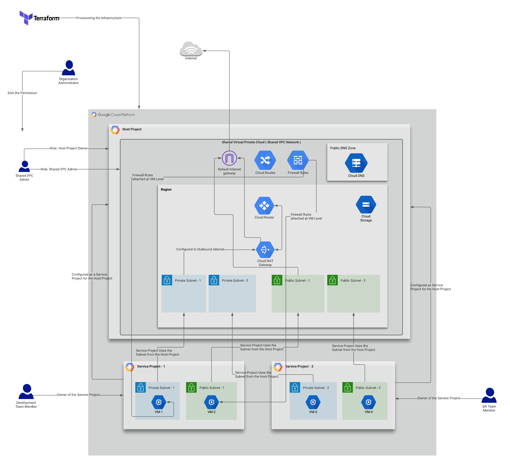
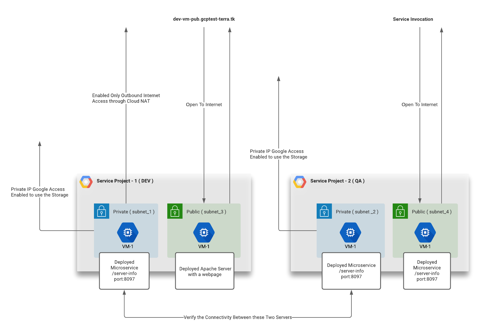

# Deploying Shared VPC with Terraform

This is a Terraform script which can be used to deploy and manage a Shared VPC Network.

## Setup Architecture

Below is the Architecture Diagram which will be implemented using the Terraform Script.



## How to Run

```
1) Create a Google Cloud Account with Organization Administrator Permission ( For this POC Implementation we are using the gcloud auth application-default login which used to acquire new user credentials to use for Application Default Credentials )

2) Create three accounts.
dev@mitralabs.co.uk
qa@mitralabs.co.uk
networkadmin@mitralabs.co.uk

3) Login as the Organization Administrator and create a bucket in the Google Cloud Storage as common place to store the Distributions. This is not automated due to a time out concern appeared when uploading the large files. In this case we are using a JDK distribution and JAR file for the Microservice Implemenatation to load to VMs. 

Go to Manage Resources
Create a Folder poc-dev
Inside the Folder create a project for Cloud Storage Project
Inside the Cloud storage Project - Create a bucket named: distributions-bucket
Upload the modules/shared-vpc/distributions/jdk-11.tar.xz
Upload the modules/app-jars/server-info.jar
Give the Public Access for all Users

4) Update the Below Variables in dev/terraformtfvars, for a minimum configuration update, need to update the below:

credentials           = "credentials.json"
folder_id             = "573052883711"
billing_account_id    = "XXXXXXXXX"
org_id                = "XXXXXXXXX"

dev_email = "user:dev@mitralabs.co.uk"
qa_email = "user:qa@mitralabs.co.uk"
network_email = "user:networkadmin@mitralabs.co.uk"

Also if you want to change the DNS, update the domain name here

public_dns_zone = {
    name    = "gcp-test-pub-zone"
    dns     = "gcptest-terra.tk."
}

public_dns_zone_recordset = {
    name = "dev-vm-pub"
}

And can use the https://www.freenom.com/en/index.html?lang=en to configure the name servers and get a domain to test this fuctionality. The nemservers generated for this deployment can be fetched from Cloud DNS Configuration

5) Execution

Go to dev folder and execute the below commands.
terraform init
terraform plan
terraform apply

Also to destroy the resources
terraform destroy

Note that when destroying the Projects will not be Deleted permananetly, due to that if you run the script again within 3-days need to rename to a new one and execute the apply.

6) Scenarios can be verified are as based on the below diagram.
```
